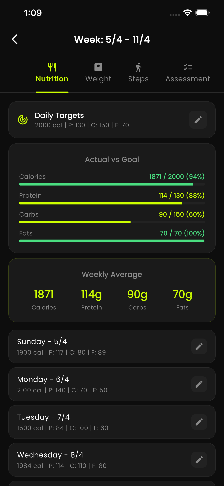
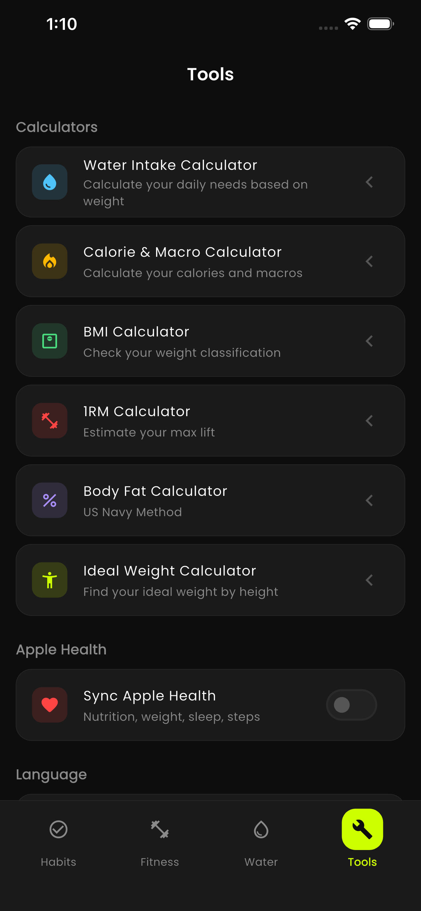
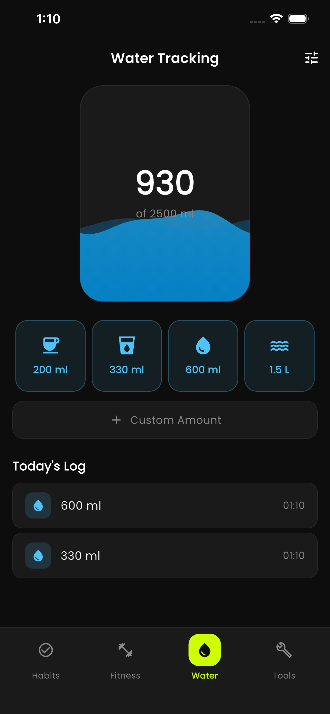

<p align="center">
  
</p>

<h1 align="center">Refit</h1>

<p align="center">
  Build lasting habits, track your fitness, and stay hydrated — one day at a time.
</p>

<p align="center">
  <a href="https://flutter.dev"></a>
  <a href="https://dart.dev"></a>
  
  <a href="LICENSE"></a>
</p>

---

Refit is an offline-first habit tracking and fitness app built with Flutter. It combines daily habit tracking, weekly fitness cycles, and water intake in a single dark-themed app. No account, no ads, no tracking — all data stays on your device.

## Features

### Habits
- Create custom daily habits and mark them complete from a grid
- Streaks, weekly overview, and monthly calendar
- Completion-rate statistics and habit ranking
- Daily mood and sleep logging

### Fitness
- Weekly fitness cycles with nutrition, weight, steps, and body measurements
- Calorie and macro tracking with customizable targets and averages
- Body measurement photos for side-by-side progress
- Weekly self-assessments
- Step tracking synced with Apple Health / Health Connect

### Water
- Daily water intake tracking
- Reminder notifications
- Apple Health sync

### Tools
- Water intake, calorie & macro, BMI, 1RM, body fat, and ideal weight calculators
- Profile-aware pre-fill so calculators use your saved data
- Apple Health sync toggle

### App
- Full Arabic and English support with RTL/LTR layouts
- Dark theme only, with a neon-green accent
- Local notifications and home-screen widgets
- JSON backup and restore
- Biometric app lock
- Onboarding and interactive tutorials

## Screenshots

| Nutrition | Tools | Water |
| :---: | :---: | :---: |
|  |  |  |

## Tech Stack

| Area | Choice |
| --- | --- |
| Framework | Flutter (Dart SDK ^3.10.8) |
| State management | `provider` (`ChangeNotifier`) |
| Local database | `sqflite` |
| Charts | `fl_chart` |
| Health data | `health` (Apple Health / Health Connect) |
| Notifications | `flutter_local_notifications` + `timezone` |
| Home widgets | `home_widget` |
| Auth | `local_auth` |
| Backup files | `share_plus`, `file_picker` |
| Media | `image_picker` |
| Onboarding | `tutorial_coach_mark` |
| Fonts | `google_fonts` |

## Architecture

- **State:** Four global `ChangeNotifier` providers in `lib/providers/` — `HabitProvider` (habits, entries, daily logs, streaks), `FitnessProvider` (fitness weeks, nutrition, weight, steps, measurements, assessments, macro targets), `WaterProvider`, and `LocaleProvider`.
- **Data:** A single `DatabaseService` singleton backed by sqflite. All tables use UUID primary keys, dates are stored as ISO 8601 strings, and inserts use `ConflictAlgorithm.replace`. The database is currently at schema version 2.
- **UI:** RTL/LTR is driven by `LocaleProvider` via a `Directionality` wrapper. The theme lives in `lib/utils/app_theme.dart`.

## Project Structure

```
lib/
├── main.dart              # App entry, providers, and tab shell
├── l10n/                  # Arabic & English strings
├── models/                # Immutable models with toMap/fromMap + copyWith
├── providers/             # ChangeNotifier state (habit, fitness, water, locale)
├── screens/
│   ├── habit_tracker/     # Grid, calendar, stats, mood & sleep
│   ├── fitness_tracker/   # Weeks, nutrition, weight, steps, measurements, assessments
│   ├── water_tracker/     # Water intake
│   ├── settings/          # Tools: calculators, Apple Health sync, backup/restore, profile
│   └── onboarding/        # First-run onboarding
├── services/              # Database, health, notifications, widgets, tutorials
├── utils/                 # Theme and colors
└── widgets/               # Shared widgets
```

## Getting Started

### Prerequisites

- [Flutter SDK](https://docs.flutter.dev/get-started/install) with Dart `^3.10.8`
- Android Studio or Xcode for running on a device/emulator

### Run

```bash
git clone https://github.com/0xffvirus/refit-app.git
cd refit-app
flutter pub get
flutter run
```

### Quality Checks

```bash
flutter analyze
flutter test
```

### Build

```bash
flutter build apk      # Android
flutter build ios      # iOS
```

## Platform Notes

- **iOS:** HealthKit usage descriptions are declared in `ios/Runner/Info.plist`. Enable the HealthKit capability in Xcode before building. Camera and photo library access are used for body measurement photos.
- **Android:** The app requests notification and exact alarm permissions. Step sync uses Health Connect when available.
- **Storage:** Everything is stored locally with sqflite — there is no backend service.

## Privacy

All data stays on your device. No account is required, and nothing is sent to a server. See [privacy_policy.md](privacy_policy.md) for details.

## Contributing

Contributions are welcome. For larger changes, please open an issue first to discuss the approach.

1. Fork the repository
2. Create a feature branch (`git checkout -b feature/my-feature`)
3. Run `flutter analyze` and `flutter test` before committing
4. Open a pull request

## License

Released under the [MIT License](LICENSE).
